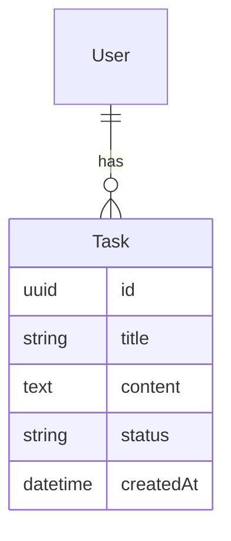

# MVP Bootstrap

用 Next.js + shadcn/ui + Prisma + Vercel 快速构建并部署 AI 小工具。

**核心原则**：先跑起来，再迭代。不做多余的东西。

---

## 技术栈选择理由

| 层 | 技术 | 理由 |
|---|---|---|
| **框架** | Next.js 15 (App Router) | 前端+API 同构，Vercel 原生支持 |
| **UI** | shadcn/ui + Tailwind CSS | 组件好使，定制灵活，无 vendor 锁定 |
| **数据库** | Prisma + Vercel Postgres | 类型安全，迁移简单，Vercel 免费 1GB |
| **AI** | OpenAI API（可配中转代理） | 生态最成熟 |
| **部署** | Vercel | GitHub 推送即部署，最短闭环 |
| **仓库** | GitHub | 已有账号，一键导入 Vercel |

**不选 FastAPI 的原因**：FastAPI 后端需要单独部署，GitHub + Vercel 闭环不了

---

## 项目初始化（Next.js + shadcn）

```bash
# 1. 创建 Next.js 项目
npx create-next-app@latest my-project \n  --typescript \n  --tailwind \n  --eslint \n  --app \n  --src-dir \n  --import-alias "@/*"

# 2. 进入项目
cd my-project

# 3. 初始化 shadcn/ui
npx shadcn@latest init
# 选择：Default / Slate / Yes

# 4. 按需添加组件
npx shadcn@latest add button card input textarea form
npx shadcn@latest add dialog sheet toast skeleton badge

# 5. 安装 Prisma
npm install prisma @prisma/client
npx prisma init

# 6. 安装常用依赖
npm install openai @ai-sdk/openai zod react-hook-form @hookform/resolvers
npm install lucide-react clsx tailwind-merge class-variance-authority
npm install @vercel/postgres @vercel/blob
```

---

## 标准目录结构

```
my-project/
├── prisma/
│   └── schema.prisma          # 数据模型
├── src/
│   ├── app/                   # Next.js App Router
│   │   ├── (main)/           # 页面组（可按需拆分）
│   │   │   ├── page.tsx      # 首页
│   │   │   └── layout.tsx
│   │   ├── api/              # API Routes
│   │   │   └── chat/route.ts
│   │   ├── page.tsx          # 落地页
│   │   └── layout.tsx        # 根布局
│   ├── components/           # 组件
│   │   ├── ui/              # shadcn 组件
│   │   ├── chat-form.tsx    # 业务组件
│   │   └── chat-list.tsx
│   ├── lib/                  # 工具
│   │   ├── prisma.ts        # Prisma client 单例
│   │   ├── utils.ts         # cn() 等工具
│   │   └── openai.ts        # AI 配置
│   └── types/               # 类型定义
├── public/                   # 静态资源
├── .env.local               # 本地环境变量
├── .env.example             # 环境变量模板（推 GitHub）
├── CLAUDE.md                # 项目说明（必写！）
├── README.md                # 快速开始
└── next.config.ts
```

---

## MVP 开发流程（5 步）

### 第 1 步：PRD（想清楚再做）

输出 `docs/PRD.md`：

```markdown
# 产品名称

## 典型用户画像
> 一句话描述：谁在什么场景下用

## 场景故事
> 用户遇到什么问题 → 怎么用产品解决

## MVP 功能清单

### ✅ 做
- [ ] 功能 A
- [ ] 功能 B

### ❌ 不做
- 用户管理/权限系统
- 高级数据分析
- 移动端适配
- ...

## 交互流程
1. 用户来到首页
2. 输入 XXX
3. 点击生成
4. 查看结果
5. （可选）保存/分享

## 成功标准
> 怎么算 MVP 完成？
> - 用户能完成核心流程
> - 无明显 bug
```

### 第 2 步：系统设计（DESIGN.md）

输出 `docs/DESIGN.md`：

```markdown
# 技术选型

## 为什么用这个组合
> 简述选型理由

## 架构图
```
用户 → Next.js (Vercel) → Prisma → Vercel Postgres
              ↓
         OpenAI API
```

## 数据模型（Mermaid ER 图）


## API 设计

| 端点 | 方法 | 说明 |
|------|------|------|
| `/api/tasks` | POST | 创建任务 |
| `/api/tasks` | GET | 列表查询 |
| `/api/chat` | POST | AI 对话 |

## 环境变量
```bash
DATABASE_URL=       # Vercel Postgres
OPENAI_API_KEY=    # OpenAI Key
OPENAI_BASE_URL=   # 中转代理（可选）
```
```

### 第 3 步：分模块实现

**原则**：
- 只做 PRD 里明确要做的功能
- 每完成一个功能立即自测
- 优先数据模型 → API → 前端

```bash
# 数据库迁移（先跑起来）
npx prisma migrate dev --name init

# 启动开发
npm run dev
```

### 第 4 步：自测验证

- [ ] 跑一遍核心用户流程
- [ ] F12 Console 无报错
- [ ] Network 请求都 200
- [ ] 移动端基本可用

### 第 5 步：部署上线

```bash
# 1. 推 GitHub
git init
git add .
git commit -m "feat: MVP 完成"
git remote add origin git@github.com:flybear16/my-project.git
git push -u origin main

# 2. Vercel 导入
# vercel.com → Add New Project → Import flybear16/my-project
# Framework: Next.js（自动检测）
# 添加环境变量（DATABASE_URL, OPENAI_API_KEY 等）

# 3. 验证部署
# 访问 vercel 提供的预览 URL 确认正常
```

---

## 必需文件清单

| 文件 | 必须？ | 说明 |
|------|:------:|------|
| `CLAUDE.md` | ✅ | 项目上下文，让我理解在做什么 |
| `README.md` | ✅ | 一页纸：是什么 + 怎么跑 + 截图 |
| `.gitignore` | ✅ | 排除 node_modules/.next/.env |
| `LICENSE` | ✅ | MIT（最简单） |
| `.env.example` | ✅ | 告诉别人要配什么变量 |

### .gitignore 模板（Next.js）

```
# dependencies
/node_modules
/.pnp
.pnp.js

# testing
/coverage

# next.js
/.next/
/out/

# production
/build

# misc
.DS_Store
*.pem

# debug
npm-debug.log*
yarn-debug.log*
yarn-error.log*

# local env files
.env*.local

# vercel
.vercel

# typescript
*.tsbuildinfo
next-env.d.ts

# prisma
*.db
*.db-journal
```

### CLAUDE.md 模板

```markdown
# 项目名称

## 是什么
> 一句话描述

## 技术栈
- Next.js 15 (App Router)
- shadcn/ui + Tailwind CSS
- Prisma + PostgreSQL
- Vercel Postgres
- OpenAI API

## 目录结构
> 简要说明各目录用途

## 核心模块
> 最重要的 3-5 个模块

## 当前任务
> 我现在在做什么

## 约定
- API 响应格式：`{ data, error }`
- 数据库用 Prisma 管理
- ...
```

### README.md 模板

```markdown
# 项目名称

> 一句话描述

## 截图
[放 1-2 张截图]

## 快速开始

```bash
git clone https://github.com/flybear16/项目名.git
cd 项目名
npm install
npx prisma migrate dev
npm run dev
```

## 环境变量

复制 `.env.example` 为 `.env.local`，填入：
- `DATABASE_URL` — Vercel Postgres 连接字符串
- `OPENAI_API_KEY` — OpenAI API Key

## 部署

推送到 GitHub，Vercel 自动部署。
```

---

## shadcn/ui 常用组件速查

| 场景 | 组件 |
|------|------|
| 按钮/表单 | `button` `input` `textarea` `label` `form` |
| 布局/容器 | `card` `sheet` `dialog` `separator` `scroll-area` |
| 展示/反馈 | `toast` `skeleton` `badge` `avatar` `progress` |
| 数据展示 | `table` `tabs` `accordion` `carousel` |
| AI/对话 | `sonner`（toast 升级）`scroll-area` `empty-state` |

```bash
# 按需添加
npx shadcn@latest add button input textarea card dialog toast
```

## Prisma 最佳实践

### schema.prisma 模板

```prisma
generator client {
  provider = "prisma-client-js"
}

datasource db {
  provider  = "postgresql"
  url       = env("DATABASE_URL")
  directUrl = env("POSTGRAS_URL_NON_POOLING")
}

model User {
  id        String   @id @default(cuid())
  email     String   @unique
  name      String?
  createdAt DateTime @default(now())
  updatedAt DateTime @updatedAt
  // relations
}

model Item {
  id        String   @id @default(cuid())
  title     String
  content   String?
  status    String   @default("active")
  userId    String
  user      User     @relation(fields: [userId], references: [id])
  createdAt DateTime @default(now())
  updatedAt DateTime @updatedAt
}
```

### Client 单例（防止热更新连接耗尽）

```typescript
// lib/prisma.ts
import { PrismaClient } from '@prisma/client'

const globalForPrisma = globalThis as unknown as { prisma: PrismaClient }
export const prisma = globalForPrisma.prisma || new PrismaClient()
if (process.env.NODE_ENV !== 'production') globalForPrisma.prisma = prisma
```

## AI 服务集成

### OpenAI（可配中转代理）

```typescript
// lib/openai.ts
import OpenAI from 'openai'

export const openai = new OpenAI({
  apiKey: process.env.OPENAI_API_KEY,
  baseURL: process.env.OPENAI_BASE_URL, // 中转代理地址，可选
})
```

### Server Action 示例（推荐）

```typescript
// app/api/chat/route.ts
import { openai } from '@/lib/openai'

export async function POST(req: Request) {
  const { message } = await req.json()
  const stream = await openai.chat.completions.create({
    model: 'gpt-4o-mini',
    messages: [{ role: 'user', content: message }],
    stream: true,
  })
  return new Response(stream.toReadableStream(), {
    headers: { 'Content-Type': 'text/event-stream' },
  })
}
```

## 快速诊断清单

部署前检查：

- [ ] `package.json` 有 `"engines": {"node": ">=18.0.0"}`
- [ ] `.gitignore` 排除 `node_modules` `.env*`
- [ ] `.env.example` 包含所有需要的变量名（不含值）
- [ ] `prisma/schema.prisma` 有 `directUrl`（Vercel Postgres 需要）
- [ ] Vercel 环境变量已配置所有 key
- [ ] `npx prisma migrate deploy` 已在生产环境跑过

---

## 与 vercel-deploy 技能的关系

本技能负责 **项目内部** 的 MVP 开发流程，vercel-deploy 技能负责 **项目外部** 的部署和平台配置。两者配合使用。

触发顺序：
1. 用 `mvp-bootstrap` 创建项目、开发功能
2. 用 `vercel-deploy` 配置 Vercel、排查部署问题
